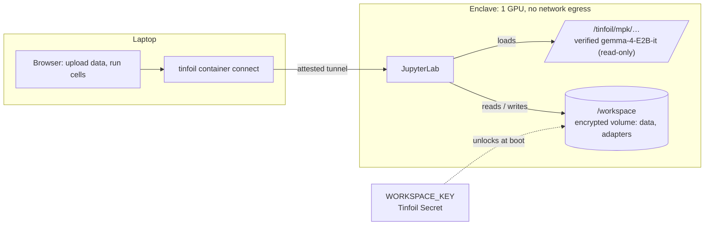

# finetuning-example

Fine-tune a language model on private data inside a [Tinfoil Container](https://docs.tinfoil.sh/containers/overview),
from a Jupyter notebook. The base model is verified, the dataset and the resulting LoRA adapter
live on an encrypted disk that survives restarts, and the enclave has no network egress.



The notebook loads `google/gemma-4-E2B-it` from a measured model pack, trains a LoRA adapter on a
sample "internal helpdesk" dataset (80 conversations, about a minute on one H200), saves the adapter
to the encrypted workspace, and shows the model before and after. Swap in your own JSONL and it is
your data.

## Deploy it

You need the [`tinfoil` CLI](https://docs.tinfoil.sh/containers/cli) logged in to an organization with
Tinfoil Containers, and a host with a free GPU (`tinfoil container hosts`).

1. **Fork this repo** (it must stay public: the release measurement is published from it). Or
   deploy `tinfoilsh/finetuning-example` directly and skip the release step.

2. **Create the two secrets.** The notebook login token, and the key that unlocks the workspace.
   The key is 64 random bytes; it is only ever released into an enclave running this measured config.

   ```sh
   openssl rand -hex 32 | tr -d '\n' | tinfoil secret create JUPYTER_TOKEN --value-file -
   openssl rand -base64 64 | tr -d '\n' | tinfoil secret create WORKSPACE_KEY --value-file -
   ```

3. **Stage the base model on your host.** This downloads the weights once, wraps them into a
   verified pack and prints the `models:` block, which already matches `tinfoil-config.yml`.

   ```sh
   tinfoil model wrap google/gemma-4-E2B-it --commit 3e22461f65e89153144f8adb70e3b8c2cc9845a7 \
     --host control.<host>.tinfoil.sh --wait
   ```

4. **Release** (forks only): `gh workflow run tinfoil-release.yml -f version=v0.1.0`. The workflow
   builds the image, pins its digest into `tinfoil-config.yml`, tags the release and publishes the
   enclave measurement. Steps 3 and 4 can also be done [from the dashboard](#using-the-dashboard).

5. **Deploy.**

   ```sh
   tinfoil container create finetune --repo <owner>/finetuning-example --tag v0.1.0 \
     --host control.<host>.tinfoil.sh --secret JUPYTER_TOKEN --secret WORKSPACE_KEY
   ```

   Ready takes a few minutes (image pull plus boot). `tinfoil container get finetune` shows the status.

6. **Open the notebook through a verified tunnel.** The proxy checks the enclave's attestation
   against the published measurement before forwarding anything.

   ```sh
   tinfoil container connect finetune -p 8888
   # then open http://127.0.0.1:8888/?token=<JUPYTER_TOKEN>
   ```

   Run the cells top to bottom. `notebook/finetune.ipynb` is the same file, if you want to read it first.

## Using the dashboard

Model wrapping and releases do not need the CLI. In the [Tinfoil dashboard](https://dash.tinfoil.sh),
open **Containers**:

- **Models** tab: enter `google/gemma-4-E2B-it`, pin the revision to
  `3e22461f65e89153144f8adb70e3b8c2cc9845a7`, pick your build host and click **Prepare weights**. Once
  the wrap completes, **Copy YAML** gives you the `models:` block; it should match the one already in
  `tinfoil-config.yml`.
- **Repositories** tab: connect your GitHub account if you have not yet, select your fork and click
  **Release**. Enter a version such as `v0.1.0` and run the build. This triggers the same
  `tinfoil-release.yml` workflow as the CLI step above. An org admin role is required to release.

Secrets, deployment and the verified tunnel still go through the CLI as described above.

## What is where

| Path | What |
|---|---|
| `tinfoil-config.yml` | The measured deployment: model pack, encrypted `workspace` volume with `key-secret`, the notebook container, no `networks:` |
| `Dockerfile`, `entrypoint.sh` | PyTorch + transformers + PEFT + JupyterLab; seeds the workspace on first start |
| `notebook/finetune.ipynb` | The tutorial notebook (generated by `notebook/build_notebook.py`) |
| `data/train.jsonl`, `data/eval.jsonl` | Sample private dataset (generated by `data/make_dataset.py`) |

## Bring your own data

Training data is JSONL, one conversation per line:

```json
{"messages": [{"role": "user", "content": "..."}, {"role": "assistant", "content": "..."}]}
```

Drag the file into `data/` in the JupyterLab file browser and change the path in section 2. Uploads go
over the attested connection straight onto the encrypted volume.

## Persistence and updates

The `workspace` volume is a dm-crypt + dm-integrity disk keyed by `WORKSPACE_KEY`. Stopping,
starting or updating the container keeps it; deleting the container deletes it. Section 8 of the
notebook reloads the saved adapter after a restart.

To keep the key out of Tinfoil's hands entirely, release both secrets from your own
[keyserver](https://docs.tinfoil.sh/containers/private-secrets) by setting `keyserver-url` in the config.

## Learn more

- [Tinfoil Containers overview](https://docs.tinfoil.sh/containers/overview)
- [`tinfoil` CLI reference](https://docs.tinfoil.sh/containers/cli)
- [Verified model packs](https://docs.tinfoil.sh/containers/models)
- [Private secrets and keyservers](https://docs.tinfoil.sh/containers/private-secrets)

## License

[Apache-2.0](LICENSE)
